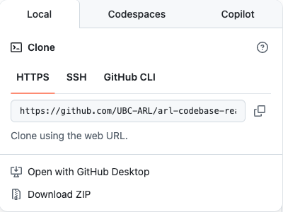

# Git & GitHub

Please note that Git and GitHub are two **different** things. Git is a version control system, while GitHub is a platform for hosting Git repositories. You can use Git without GitHub. But to use GitHub, in most cases you need to know Git.

## Git

[Git](https://git-scm.com/) is a free and open source distributed version control system designed to handle everything from small to very large projects with speed and efficiency.

### Installation

Install through your package manager:

- Windows
  ```powershell
  winget install --id Git.Git -e --source winget
  ```
- macOS
  ```bash
  brew install git
  ```

### Configuration

```bash
git config --global user.name "Your Name"
git config --global user.email "your.email@example.com"
```

### Learning Material

Go through [this tutorial](https://learngitbranching.js.org/), and you will be a Git master in no time.

## GitHub

Sign up for a [GitHub](https://github.com/) account, if you don't have one yet.

### Clone a Repository

For example, to clone the code of this book, run the following command in your terminal:

```bash
cd ~/path/to/your/workspace
git clone https://github.com/UBC-ARL/arl-codebase-readme.git
```

The repository link can be found here:



> Note that `Download ZIP` will not initialize a Git repository. It is just a snapshot of the code at that time. You will not be able to use Git commands on it.

### GitHub Pages

This book is hosted on [GitHub Pages](https://pages.github.com/). Each repository can have a static website through GitHub Pages. You can find the settings in the repository settings page.

### GitHub Issues

[GitHub Issues](https://github.com/features/issues) is a great way to track bugs and feature requests. You can create an issue by clicking on the `Issues` tab in the repository, and then clicking on the `New Issue` button.
You can also assign labels, milestones, and assignees to the issue. This is a great way to keep track of what needs to be done, and who is responsible for it.
